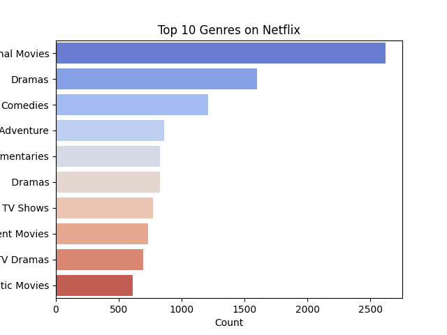
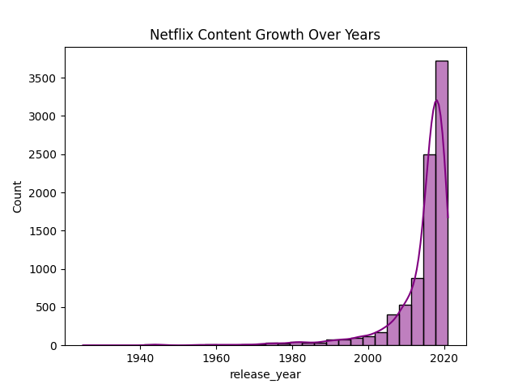

# Netflix Data Analytics Project 🎬

This is my first data analytics project using Jupyter Notebook.  
It explores the Netflix dataset with insights such as:
- Genre distribution
- Ratings analysis
- Content growth over years
- Movies vs TV shows comparison

## Overview
This project analyzes the Netflix dataset to uncover insights about content trends, genres, ratings, and viewer preferences.  
It demonstrates skills in data cleaning, exploratory data analysis (EDA), and visualization using Python.

## Features
- Data cleaning and preprocessing
- Exploratory Data Analysis (EDA) with charts
- Genre and rating distribution analysis
- Interactive Jupyter Notebook for reproducibility

## Tech Stack
- Python (Pandas, NumPy, Matplotlib, Seaborn)
- Jupyter Notebook
- Git & GitHub

## Repository Structure
- `notebook/data/netflix-analysis.ipynb` → Jupyter Notebook with outputs
- `notebook/data/netflix_titles.csv` → Dataset
- `notebook/data/images/` → Saved visuals (charts and plots)
- `requirements.txt` → Dependencies
- `README.md` → Project overview

## How to Run
1. Clone the repository:
   ```bash
   git clone https://github.com/ravi-inovate/Netflix-Data-Analytics.git
   
- `pip install -r requirements.txt` 
- `jupyter notebook notebook/data/netflix-analysis.ipynb`

## Results / Visuals
Here are some of the visuals generated in the analysis:






## Contact
- GitHub: [ravi-inovate](https://github.com/ravi-inovate)
- LinkedIn: [My LinkedIn](https://www.linkedin.com/in/ravi-rathour-770377385)
- Email: ravirathour0038@gmail.com

